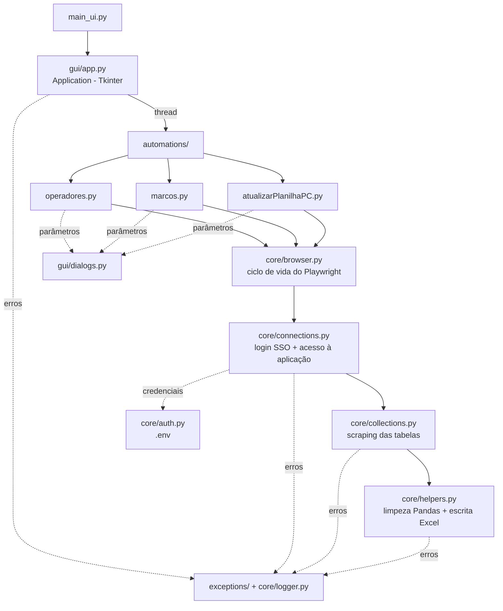

# PraContar Automações

> Automação de coleta de dados (web scraping) da plataforma **Mapia** com interface gráfica desktop, exportação para Excel e atualização incremental de planilhas de produtividade.

<p align="left">
  
  
  
  
  
</p>

---

## Sobre o projeto

Tarefas de extração de relatórios do portal Mapia (GPO) que antes eram feitas manualmente — navegar, filtrar por operador/mês, paginar tabelas, copiar e colar em planilhas — passam a ser executadas por um robô com poucos cliques.

A aplicação abre uma janela desktop, realiza o login via SSO da AWS de forma automatizada, navega até a aplicação desejada, pergunta ao usuário os parâmetros da coleta (data, mês/ano, esteiras e estações) e devolve o resultado já tratado em formato Excel.

### O que ela faz

| Automação | Descrição | Saída |
|---|---|---|
| **Coleta de Operadores** | Extrai do painel de Desempenho as métricas de tempo trabalhado e atividades de todos os operadores ativos numa data específica. | `Coleta_Operadores_<data>_cod<N>.xlsx` em `Downloads` |
| **Coleta de Marcos** | Percorre a tela de Marcos das esteiras/estações escolhidas, itera sobre toda a paginação e coleta obrigações e status de conclusão do mês/ano. | `Coleta_Marcos_<mes>_<ano>_cod<N>.xlsx` em `Downloads` |
| **Atualizar Planilha Produtividade** | Coleta os dados de operadores e os insere de forma **incremental** na aba `Base em min` de uma planilha existente, já aplicando fórmulas (`VLOOKUP`), formatos numéricos e fonte padronizada. | Atualiza o `.xlsx` definido em `CAMINHO_PLANILHA_ATUALIZAR` |

### Destaques técnicos

- **Interface responsiva** — a automação roda em *thread* secundária com barra de progresso em tempo real, mantendo a janela viva durante coletas longas.
- **Diálogos sincronizados com o navegador** — ponte entre a thread do Playwright e o *event loop* do Tkinter (`core`/`gui`), permitindo perguntar parâmetros ao usuário **no meio** da automação sem travar nem o navegador nem a UI.
- **Tratamento de erros em camadas** — exceções customizadas separam o que é mensagem amigável para o usuário do *stack trace* técnico, que vai para o arquivo de log.
- **Limpeza de dados via decorators** — as regras de tipagem/formatação de cada coleta ficam isoladas em decorators, sem poluir a extração.
- **Escrita otimizada em Excel** — carga única do workbook, `append` por linha e um único `save` ao final, com `lxml` habilitado.

---

## Arquitetura



### Estrutura de pastas

```
.
├── main_ui.py                    # Ponto de entrada da aplicação
├── requirements.txt
├── .env                          # Credenciais (NÃO versionado)
├── automations/                  # Orquestração de cada fluxo ponta a ponta
│   ├── operadores.py
│   ├── marcos.py
│   └── atualizarPlanilhaPC.py
├── core/
│   ├── auth.py                   # Leitura das credenciais do .env
│   ├── browser.py                # Inicialização e encerramento do Playwright
│   ├── connections.py            # Login SSO/AWS e entrada nas aplicações Mapia
│   ├── collections.py            # Raspagem das telas de Desempenho e Marcos
│   ├── helpers.py                # Limpeza de dados e geração/atualização de Excel
│   └── logger.py                 # Logger de arquivo + console
├── exceptions/
│   └── customExceptions.py       # Hierarquia de erros de negócio
├── gui/
│   ├── app.py                    # Janela principal, threads e barra de progresso
│   └── dialogs.py                # Diálogos de parâmetros (data, mês/ano, esteiras)
├── public/
│   └── icon.png                  # Ícone da janela
└── logs/
    └── app.log                   # Gerado em tempo de execução
```

---

## Instalação

**Pré-requisitos:** Python 3.12+ (desenvolvido em 3.14) e Windows.

```bash
git clone <url-do-repositorio>
cd web_scrapping

python -m venv .venv
.venv\Scripts\activate

pip install -r requirements.txt
playwright install chromium
```

> O passo `playwright install chromium` é obrigatório: ele baixa o navegador usado pela automação e não é resolvido pelo `pip`.

### Configuração

Copie o arquivo de exemplo e preencha com suas credenciais:

```bash
copy .env.example .env
```

| Variável | Descrição |
|---|---|
| `MAPIA_LOGIN` | E-mail de acesso ao portal Mapia/AWS |
| `MAPIA_SENHA` | Senha correspondente |
| `CAMINHO_PLANILHA_ATUALIZAR` | Caminho absoluto do `.xlsx` a ser atualizado pela automação de produtividade (precisa conter a aba `Base em min`) |

⚠️ O `.env` contém credenciais reais e está no `.gitignore`. **Nunca** faça commit dele.

---

## Como usar

```bash
python main_ui.py
```

1. Selecione a automação desejada na janela.
2. Clique em **Executar** — o login é feito automaticamente em uma janela do Chromium.
3. Responda aos diálogos de parâmetros que aparecem durante o processo:
   - **Operadores / Produtividade:** data padrão (último dia útil anterior) ou data específica em `dd/mm/aaaa`.
   - **Marcos:** parâmetros padrão (mês de competência anterior) ou seleção manual de mês/ano, seguida da escolha das esteiras e estações (`Ctrl`/`Shift` para múltipla seleção, ou **Selecionar Tudo**).
4. Acompanhe a barra de progresso. Ao final, uma mensagem confirma a conclusão e o arquivo estará em `Downloads` (ou a planilha configurada terá sido atualizada).

> Não feche a janela durante a execução. A coleta de marcos com muitas estações pode levar vários minutos.

### Modo visível vs. headless

Por padrão o navegador roda **oculto** (`headless=True`). Para acompanhar a navegação — útil ao depurar seletores que mudaram no site —, ajuste a chamada em [core/browser.py](core/browser.py):

```python
browser = playwright.chromium.launch(headless=False)
```

---

## Tratamento de erros e logs

As exceções de negócio herdam de `BaseAutomationException` e são convertidas em mensagens claras na interface:

| Exceção | Quando ocorre |
|---|---|
| `BrowserException` | Falha ao inicializar o navegador |
| `ConnectionException` | Falha de login, aplicação inválida ou timeout de redirecionamento SSO |
| `DataCollectionException` | Elemento não encontrado, página não carregada, tabela ausente |
| `DataCleaningException` | Erro de conversão no Pandas ou ao salvar/atualizar o Excel |

Qualquer erro inesperado é registrado com *stack trace* completo em `logs/app.log` (nível `DEBUG`); apenas erros críticos aparecem no console.

---

## Solução de problemas

| Sintoma | Causa provável / solução |
|---|---|
| `Erro ao tentar fazer login` | Credenciais incorretas no `.env`, rede instável ou mudança no layout da tela de login da AWS. |
| `Não foi possível carregar a página de Desempenho` | Sessão expirada ou instabilidade do portal. Tente novamente. |
| `Erro ao salvar a planilha Excel` | O arquivo de destino está aberto no Excel. Feche-o e repita. |
| `Erro ao atualizar a planilha` | Caminho inválido em `CAMINHO_PLANILHA_ATUALIZAR` ou ausência da aba `Base em min`. |
| `Falha ao organizar colunas...` | O layout das tabelas no site mudou — os nomes/ordem das colunas em [core/collections.py](core/collections.py) precisam ser revistos. |
| `Aviso: o arquivo public\icon.png não foi encontrado` | Execute o programa a partir da raiz do projeto; o caminho do ícone é relativo ao diretório de trabalho. |
| Coleta retorna vazia | Não há registros para a data/mês selecionado, ou o operador/estação não teve movimento no período. |

---

## Manutenção

Este projeto depende de **seletores CSS/HTML de um site de terceiros**. Alterações no portal Mapia podem quebrar a automação sem aviso. Os pontos mais sensíveis são:

- Seletores de login em [core/connections.py](core/connections.py) (`input#awsui-input-0`, botões `Próximo` / `Sign in`).
- IDs das telas em [core/collections.py](core/collections.py) (`#operador`, `#mes`, `#ano`, `#milestones`, `#datatable_marco`, `#tabela_estacoes_trabalhadas_por_dia`).
- Quantidade e ordem das colunas das tabelas (`colunasMapiaOperador` e `colunas_marcos`) — se o site adicionar uma coluna, as linhas passam a ser descartadas silenciosamente pela validação de tamanho.

---

## Stack

| Tecnologia | Uso |
|---|---|
| [Playwright](https://playwright.dev/python/) | Automação do navegador e raspagem |
| [Pandas](https://pandas.pydata.org/) | Estruturação e limpeza dos dados |
| [openpyxl](https://openpyxl.readthedocs.io/) + [lxml](https://lxml.de/) | Leitura/escrita de arquivos `.xlsx` |
| [python-dotenv](https://pypi.org/project/python-dotenv/) | Gestão de variáveis de ambiente |
| Tkinter | Interface gráfica desktop |

---

## Aviso

Ferramenta de uso interno, destinada a automatizar o acesso a dados aos quais o próprio usuário já tem permissão. Os dados coletados incluem informações de operadores e clientes — trate as planilhas geradas como **confidenciais** e não as versione neste repositório.
